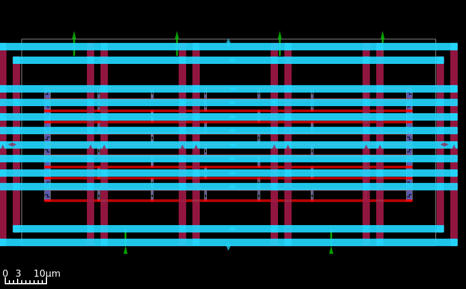
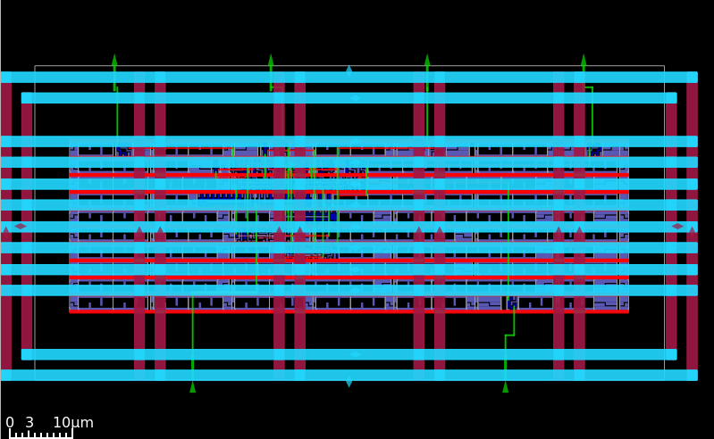
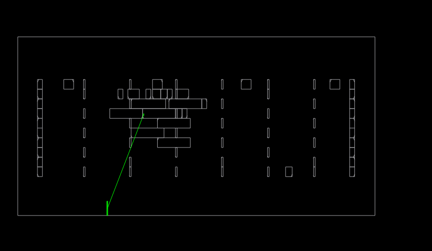

# Physical Design of a 4-Bit Counter using Sky130 PDK

## Overview
This project demonstrates the complete RTL-to-GDSII physical design flow of a 4-bit synchronous counter. Instead of using an automated "push-button" flow, this project was executed using **OpenLane/OpenROAD in Interactive Mode** to manually control floorplanning, power distribution, and clock tree synthesis.

## Key Specifications
* **Technology Node:** SkyWater 130nm (sky130_fd_sc_hd)
* **Clock Target:** 100 MHz (10.0ns period)
* **Die Area:** 100um x 50um (Custom Aspect Ratio)
* **Target Density:** 50%

## Physical Design Methodology
1. **Floorplanning & Power Planning:** Designed a custom rectangular floorplan with a dedicated VDD/VSS core ring to minimize IR drop.
2. **I/O Pin Placement:** Manually constrained input pins to the South edge and output pins to the North edge using a custom `pin_order.cfg`.
3. **Clock Tree Synthesis (CTS):** Synthesized a balanced clock tree resulting in zero setup/hold violations. 
4. **Routing & Signoff:** Completed detailed routing with **0 DRC Violations** and passed OpenROAD antenna repair checks.

## Visuals

> **Figure 1:** Custom floorplan showing the macro power ring and standard cell power grid.

> **Figure 2:** Final detailed routing showing standard cell placement and metal layer utilization.

> **Figure 3:** Clock Tree Synthesis (CTS). Since this is a micro-design, the 4-bit counter logic was tightly centralized during placement. The CTS engine leveraged this by routing a direct, unbuffered clock trunk to equalize timing and save power, rather than building a standard H-tree.

## Timing & Power Results
* **Setup Slack (WNS):** +7.17 ns (Met)
* **Hold Slack:** +0.32 ns (Met)
* **Total Power:** 39.3 uW